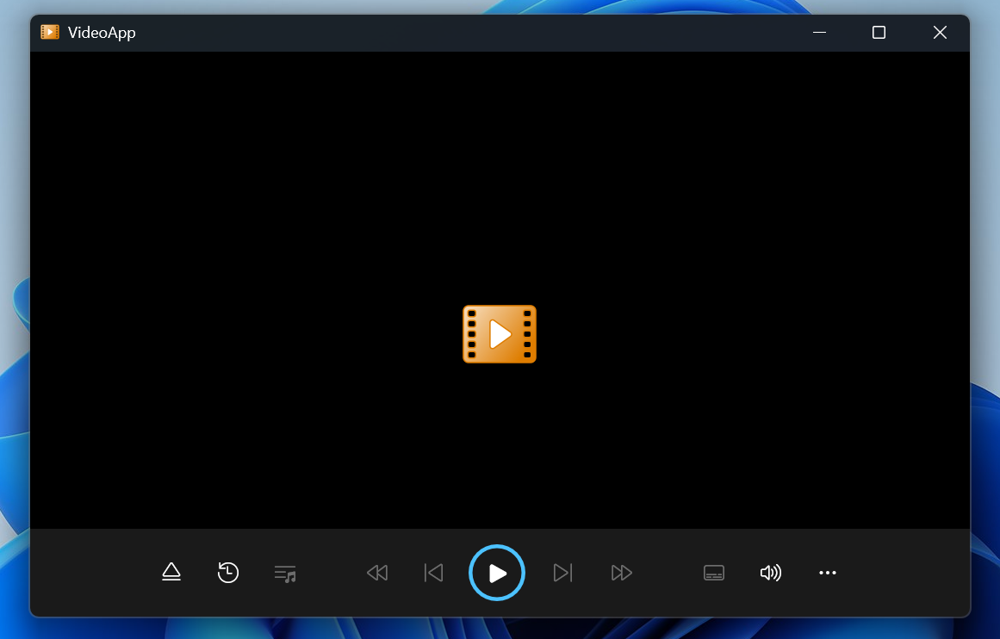

# VideoApp

This is a lightweight video player built using WinUI and libVLC. The main goal of this project is to explore how to integrate and use libVLC in a Windows app. The player is designed to be simple and minimal — it only plays video files, nothing more. It features a clean, native Windows 11 interface for a seamless user experience. Perfect for those curious about libVLC or looking for a basic video player example!

The project is in active development, and binary releases are not available yet. All source code can be found in the dev branch.

